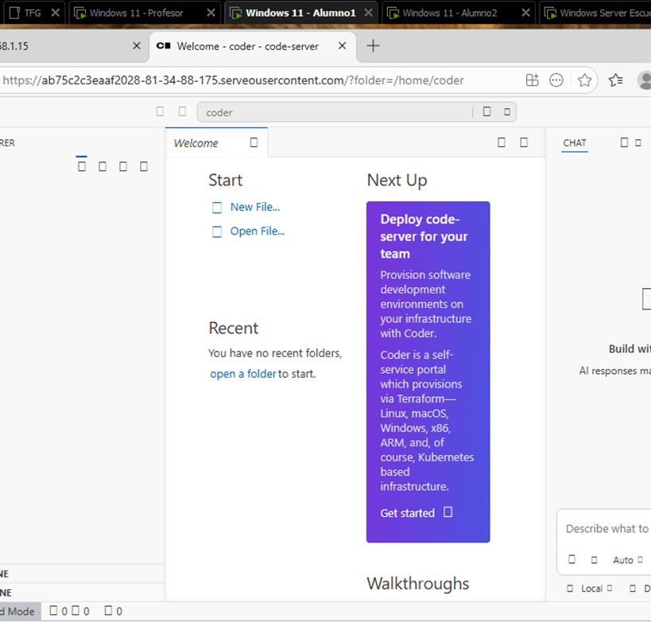

# Proof of Concept for Integrating Container-Based Development Environments into Existing Active Directory Classrooms

A Proof of Concept demonstrating how Kubernetes-based development environments can be integrated into existing Windows classrooms managed by Active Directory Domain Services (AD DS) without replacing the existing infrastructure.

---

## Why This Project?

Many educational institutions already have Windows classrooms managed through Active Directory.

Replacing this infrastructure to adopt modern container-based development environments is often impractical due to cost, administration, and operational constraints.

This project investigates whether Kubernetes can be integrated into an existing classroom while preserving the current management model.

The project focuses not only on the final solution, but also on the engineering decisions, implementation challenges, workarounds, and lessons learned throughout the development process.

---

## Overview

Modern software development increasingly relies on containerized environments to provide consistency, isolation and reproducibility.

This Proof of Concept evaluates the feasibility of introducing Kubernetes into traditional Active Directory classrooms while reusing the existing infrastructure and hardware already available.

---

## Research Question

> Can container-based development environments be integrated into existing Active Directory classrooms without replacing the existing infrastructure?

---

## Technologies Used

* Kubernetes (k3s)
* Windows 11
* Active Directory Domain Services (AD DS)
* Windows Subsystem for Linux 2 (WSL2)
* PowerShell
* Bash
* Portainer
* VMware Workstation
* VS Code Server (used during the Proof of Concept)

---

## Skills Demonstrated

* Kubernetes deployment
* Infrastructure automation
* Windows administration
* Active Directory integration
* WSL2 administration
* Linux administration
* PowerShell scripting
* Bash scripting
* Containerized development environments
* Technical troubleshooting
* Technical documentation
* Infrastructure integration

---

## Proposed Architecture

The proposed architecture reuses the existing classroom infrastructure.

A teacher workstation acts as the Kubernetes control plane while student workstations join the cluster as worker nodes using WSL2.

Persistent student data is stored on the Windows host using bind mounts, allowing project files to remain available independently of the container lifecycle.

<p align="center">
  
</p>

<p align="center">
<i>Figure 1. Overall architecture of the Proof of Concept.</i>
</p>

---

## Cluster Validation

The following screenshot shows the Kubernetes cluster successfully running during the validation of the Proof of Concept.

<p align="center">
  
</p>

<p align="center">
<i>Figure 2. Kubernetes cluster showing one control plane and two worker nodes in the Ready state.</i>
</p>

---

## Key Features

* Integration with existing Active Directory classrooms.
* Lightweight Kubernetes (k3s) cluster running on WSL2.
* Distributed execution across teacher and student workstations.
* Automated deployment using PowerShell and Bash scripts.
* Browser-based development environments demonstrated using VS Code Server.
* Persistent student storage using Windows bind mounts.
* Reuse of existing classroom hardware.
* Documentation of implementation challenges and engineering decisions.

## Proposed Architecture

...

(Figura 1)

---

## Cluster Validation

The following screenshot shows the Kubernetes cluster successfully running during the validation of the Proof of Concept.

<p align="center">
  
</p>

<p align="center">
<i>Figure 2. Kubernetes cluster showing one control plane and two worker nodes in the Ready state.</i>
</p>

---

## Student Development Environment

The following screenshot shows a student accessing an isolated browser-based development environment running inside a Kubernetes pod.

<p align="center">
  
</p>

<p align="center">
<i>Figure 3. Browser-based development environment running inside a Kubernetes pod.</i>
</p>

---

## Key Features

...

---

## Proof of Concept

The implemented Proof of Concept demonstrates that container-based development environments can be integrated into existing educational infrastructures without replacing the existing Windows administration model.

The implementation validates:

* Automated deployment of development environments.
* Multi-student isolated workspaces.
* Persistent storage across sessions.
* Browser-based access to development tools.
* Centralized cluster management through Kubernetes and Portainer.
* Compatibility with existing Windows classroom infrastructure.

---

## Implementation Challenges

Rather than presenting only the final solution, this repository documents the technical challenges encountered during development.

The main investigated topics include:

* WSL2 initialization after Windows startup.
* Networking between Windows and WSL2.
* Mirrored Networking limitations.
* NodePort and Windows port forwarding.
* Persistent storage using Windows bind mounts.
* Deployment scalability.

Detailed documentation is available here:

* [Implementation Challenges](docs/implementation-challenges.md)

---

## Documentation

Additional technical documentation is available in:

* [Architecture](docs/architecture.md)
* [Deployment](docs/deployment.md)
* [Implementation Challenges](docs/implementation-challenges.md)
* [Results](docs/results.md)
* [Future Work](docs/future-work.md)

---

## Repository Structure

```text
docs/
images/
scripts/
README.md
LICENSE
```

---

## License

This repository is published for educational and research purposes.

See the [LICENSE](LICENSE) file for details.

