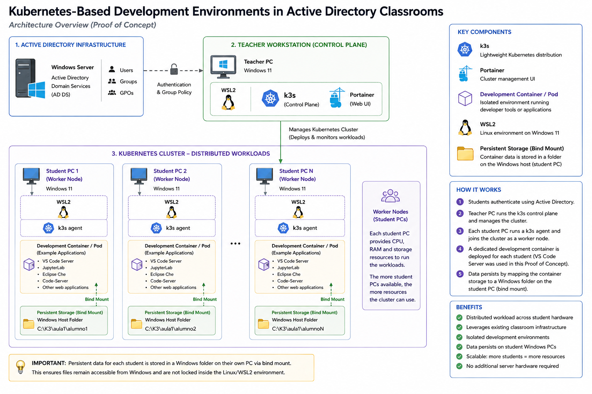
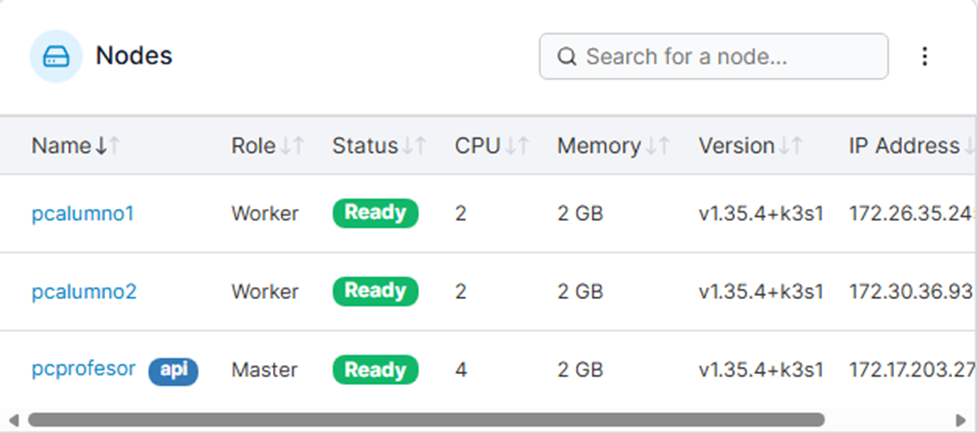

# Architecture

## Overview

This document describes the architecture of the Proof of Concept developed to evaluate the integration of Kubernetes-based development environments into existing Active Directory classrooms.

The proposed architecture reuses the existing classroom infrastructure while introducing containerized development environments with minimal changes to the traditional management model.

The architecture consists of three main components:

- Active Directory infrastructure
- Teacher workstation (Kubernetes Control Plane)
- Student workstations (Worker Nodes)

## Architecture Diagram

*Figure 1. Overall architecture of the Proof of Concept showing the integration of Active Directory, Kubernetes (k3s), WSL2, teacher and student workstations, and persistent storage.*

### Cluster Validation

The Proof of Concept was validated using one teacher workstation acting as the Kubernetes control plane and two student workstations acting as worker nodes.

*Figure 2. Validation of the Kubernetes cluster showing one control plane and two worker nodes in Ready state.*

### 1. Active Directory Infrastructure

The existing Active Directory Domain Services (AD DS) infrastructure remains unchanged.

It continues to provide:

- User authentication.
- Group Policy management.
- Centralized administration of users and computers.

The Proof of Concept integrates with the existing infrastructure instead of replacing it.

---

### 2. Teacher Workstation (Control Plane)

The teacher workstation acts as the Kubernetes control plane.

It is responsible for:

- Running the k3s server.
- Managing the Kubernetes cluster.
- Deploying student development environments.
- Monitoring cluster resources through Portainer.

The teacher workstation is the only machine responsible for orchestration.

---

### 3. Student Workstations (Worker Nodes)

Each student workstation runs Windows 11 with WSL2 and joins the Kubernetes cluster as a worker node.

Each workstation contributes its own:

- CPU
- Memory
- Storage

Instead of concentrating all workloads on a central server, every student machine provides computing resources to the cluster.

This allows the available computing capacity to grow as more workstations join the classroom.

---

### 4. Persistent Storage

Student data is stored on the Windows host using bind mounts.

Instead of remaining inside the Linux filesystem used by WSL2, project files are saved in Windows folders.

This provides several advantages:

- Files remain accessible from Windows.
- Data persists after container recreation.
- Backups can be performed using standard Windows tools.
- Students can access their files without entering the Linux environment.

---

### 5. Containerized Development Environments

Each student receives an isolated Kubernetes pod containing the required development tools.

Although VS Code Server was used during the Proof of Concept, the architecture is not limited to a single application.

Any development environment that can be containerized could be deployed using the same approach, allowing different software stacks depending on the educational requirements.
